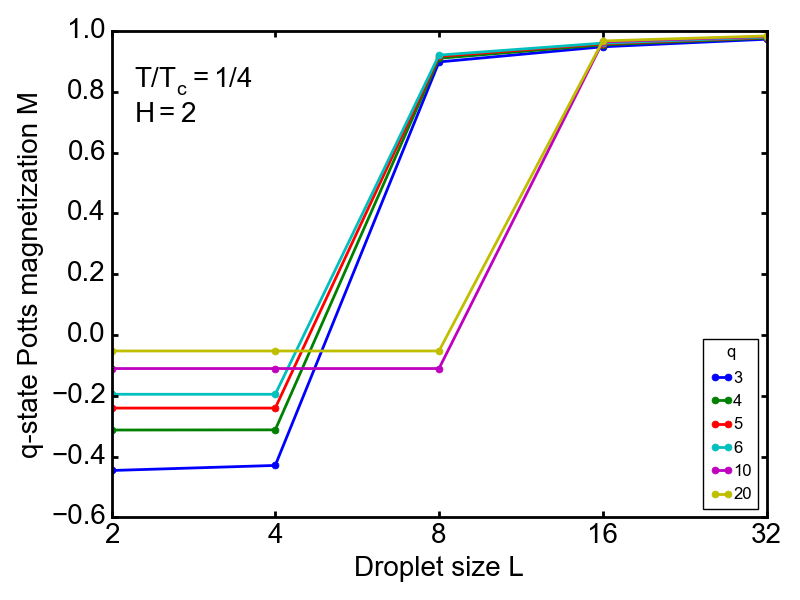
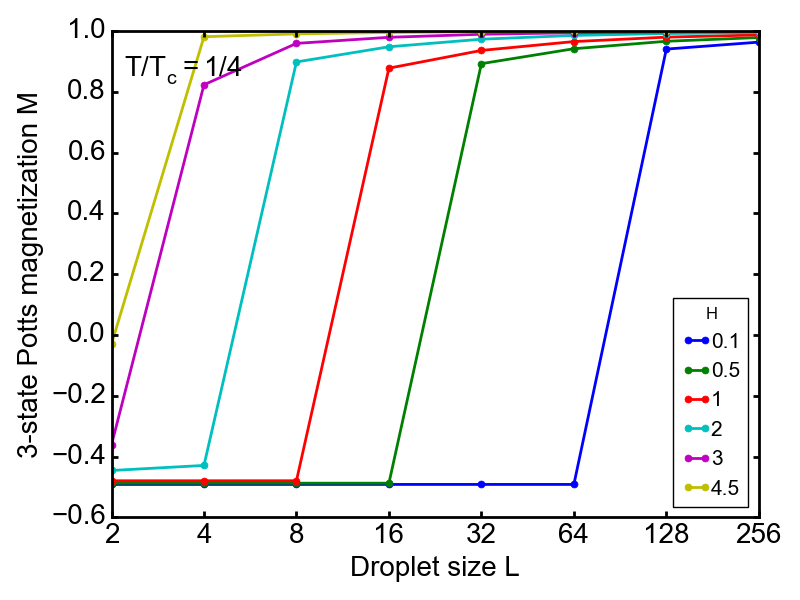
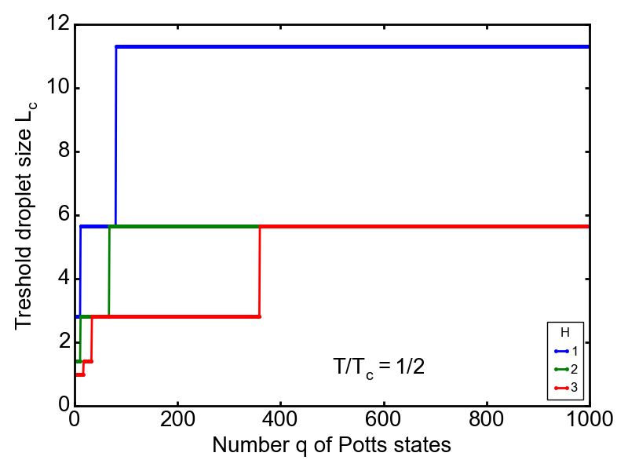
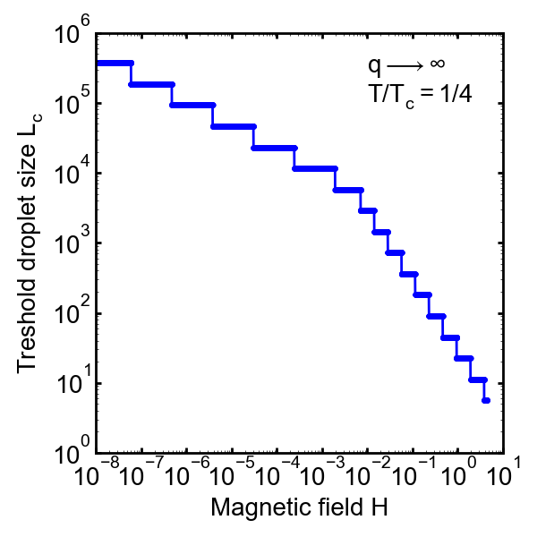
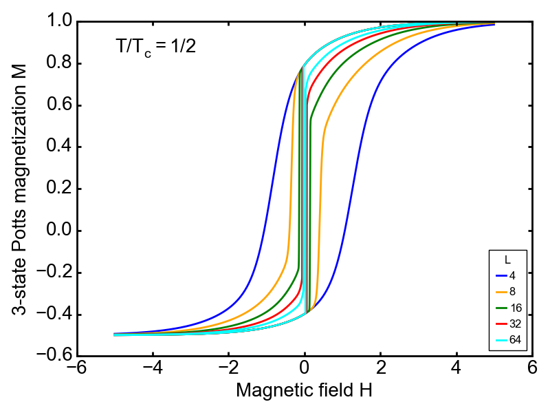
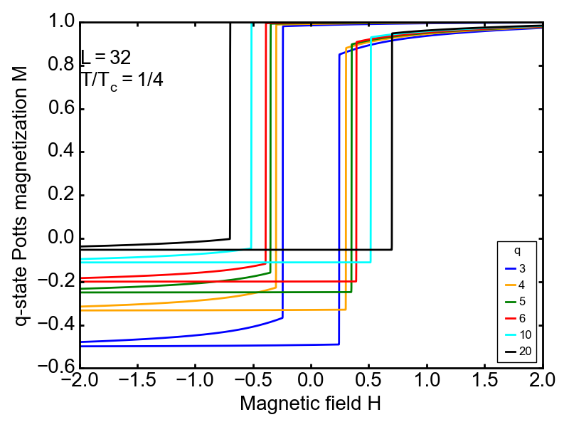
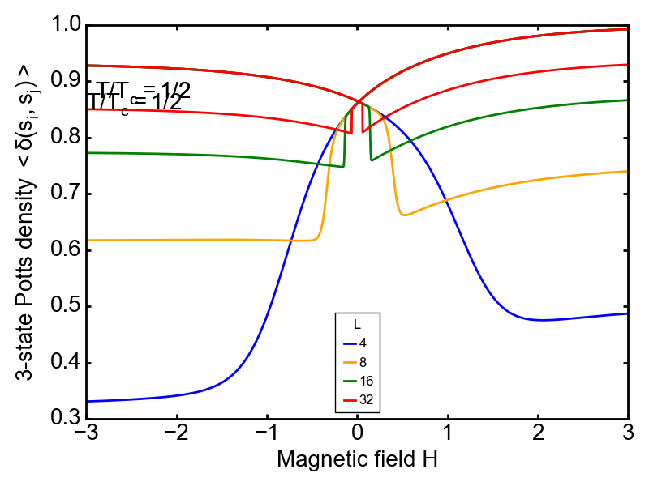

# Metastable q-State Potts Model

This repository contains Python code for calculating the properties of metastable droplets in the q-state Potts model using renormalization-group methods. The calculations extend the methods introduced for the Ising model to the Potts model, focusing on determining critical droplet sizes, hysteresis loops, and density calculations. The repository reproduces and expands on results published in *"Metastable Potts droplets"* (E. Can Artun & A. Nihat Berker, Phys. Rev. E 103, 032102. DOI: [10.1103/PhysRevE.103.032102](https://journals.aps.org/pre/abstract/10.1103/PhysRevE.103.032102)).

## Overview

This study applies finite-system renormalization-group calculations to analyze metastable droplet behavior in the Potts model across different numbers of states (q), temperature, and magnetic field. Key calculations include the critical size of metastable droplets, the hysteresis loop shapes, and their dependencies on q, system size, and external conditions.

  <table style="border: none; border-collapse: collapse;">
    <tr>
      <td style="padding: 20px;">
         
        <em style="color: #666;">Metastable Droplet Magnetizations for Different Models</em>
      </td>
      <td style="padding: 20px;">
         
        <em style="color: #666;">Metastable Droplet Magnetizations for Different Fields</em>
      </td>
    </tr>
  </table>

### Theoretical Background
The q-state Potts model generalizes the Ising model, allowing each spin to take one of $q$ possible states. This model, governed by the Hamiltonian:

$$\begin{align}
-\beta \mathcal{H} &= \sum_{\langle ij\rangle} {\{J[\delta(s_i,s_j)-1/q] + H[\delta(s_i,1) + \delta(s_j,1)]\}}
\end{align}$$

where $\delta(s_i,s_j)$  is the Kronecker delta, enables exploration of the size limits for metastable droplets within an equilibrium phase and the effects of increasing q on droplet behavior and hysteresis.

The renormalization-group transformations used here leverage the Migdal-Kadanoff approximation to calculate droplet properties for finite systems. This approach allows us to study the behavior of metastable droplets under various field and temperature conditions, yielding insights into criticality in metastable phases.

## Repository Contents

- `renormalization.py`: Implements the renormalization-group procedure, with methods for droplet calculation, hysteresis loops, and density calculations in the q-state Potts model.
- `critical_droplet.py`: Implements the calculation for determining the critical droplet sizes, including the field and temperature dependence for various $q$ values.
- `metastable_droplets.ipynb`: Jupyter notebook demonstrating the complete calculation process, including: Metastable droplet sizes, hysteresis loop generation for varying droplet size and temperature, density calculations and visualizations for metastable phases.

## Key Results

- **Critical Droplet Sizes**: Threshold sizes for metastable droplets as functions of $q$, temperature, and magnetic field, revealing the effect of increasing magnetic field on metastable size limits.

  <table style="border: none; border-collapse: collapse;">
    <tr>
      <td style="padding: 20px;">
         
        <em style="color: #666;">Critical Droplet Sizes for Varying q</em>
      </td>
      <td style="padding: 20px;">
         
        <em style="color: #666;">Maximum Critical Droplet Sizes at Infinite q</em>
      </td>
    </tr>
  </table>

- **Hysteresis Loops**: Asymmetrical hysteresis loops are calculated, demonstrating the effect of boundary conditions, droplet size, and temperature on phase retention memory.

  <table style="border: none; border-collapse: collapse;">
    <tr>
      <td style="padding: 20px;">
         
        <em style="color: #666;">Hysteresis Loops for 3-state Potts Model</em>
      </td>
      <td style="padding: 20px;">
         
        <em style="color: #666;">Hysteresis Loops for q-state Potts Model</em>
      </td>
    </tr>
  </table>

- **Density Calculations**: Visualizations and density transformations under different field and temperature conditions.

  <table style="border: none; border-collapse: collapse;">
    <tr>
      <td style="padding: 20px;">
         
        <em style="color: #666;">Energy Densities</em>
      </td>
    </tr>
  </table>

## References

1. Artun, E. C., & Berker, A. N. (2021). Metastable Potts droplets. Physical Review E, 103(3), 032102. DOI: 10.1103/PhysRevE.103.032102
